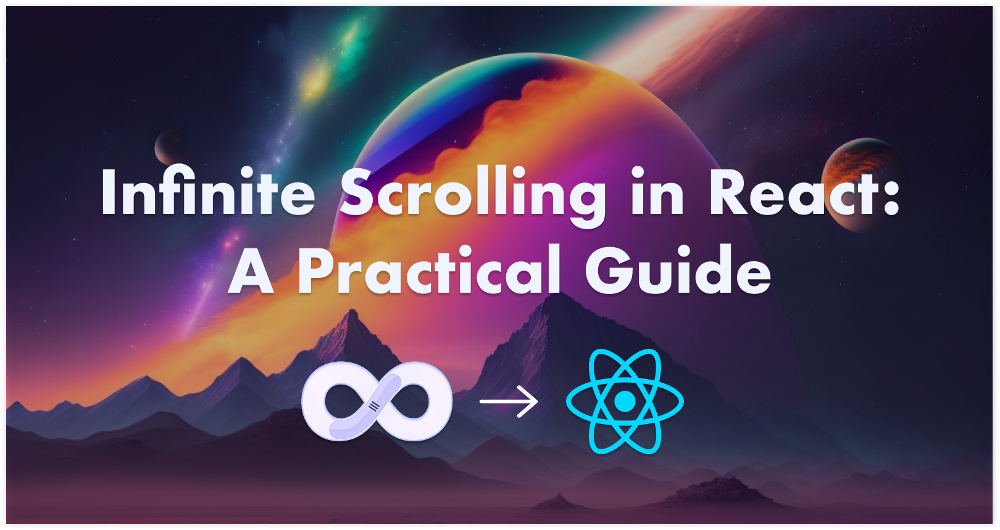

# Infinite Scrolling in React: A Practical Guide 🚀

Explore the magic of infinite scroll in React by embarking on a cosmic journey through a card-based planet explorer. Harness the power of React and Intersection Observer API to create an interactive experience.

<p align="center">
    <a href="https://tropicolx.hashnode.dev/infinite-scrolling-in-react-a-practical-guide" style="display: block;" align="center">
        
        <p>Click to Read!</p>
    </a>
</p>

---

**Table of Contents**:

- [Introduction ✊](#introduction)
- [Getting Started ⚡](#getting-started)
- [License 🪪](#license)
- [Contributing 📥](#contributing)

---

## Introduction

This repository is part of the [Infinite Scrolling in React: A Practical Guide](https://tropicolx.hashnode.dev/infinite-scrolling-in-react-a-practical-guide) article and illustrates the following.

- Implementing Infinite Scroll using the Intersection Observer API by building a planet explorer
- Discuss potential pitfalls and optimizations for infinite scrolling in React

## Getting Started

- Fork or clone this repository.

```bash
git clone https://github.com/TropicolX/space-explorer-scroll.git
```

- Using `npm` or `yarn` install the dependencies.

```bash
# Using npm
npm install

# Using yarn
yarn install
```

- Start the application

```bash
# Using npm
npm run dev

# Using yarn
yarn run dev
```

## License

This project is licensed under the [MIT License](./LICENSE).

## Contributing

You're free to contribute and make changes required to this project. Make sure to follow the [Getting Started](#getting-started) before making any changes.
